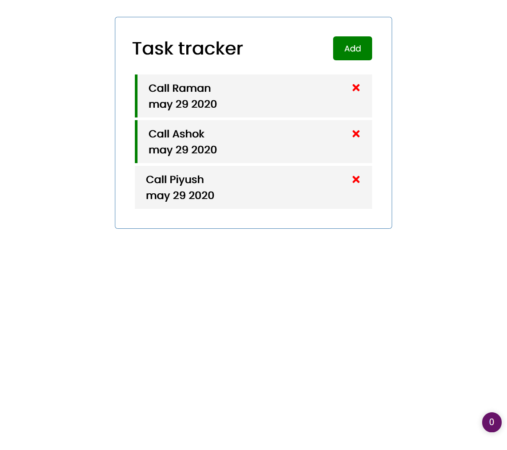
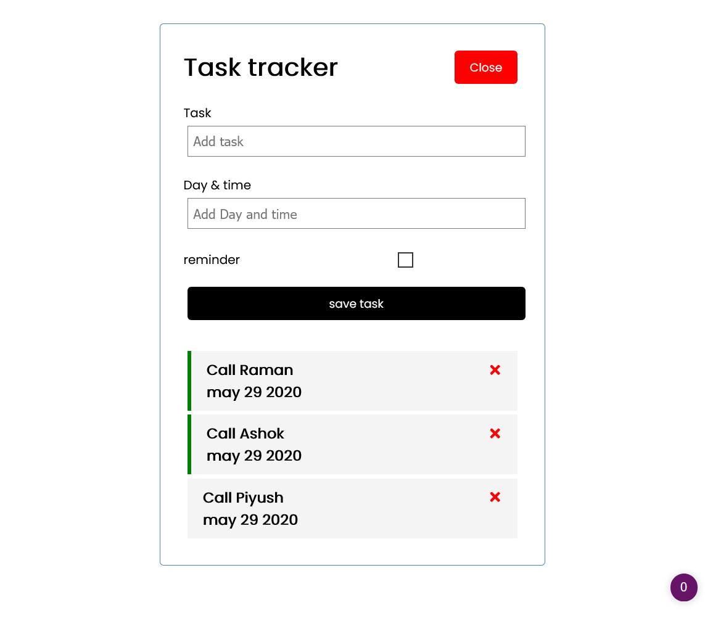
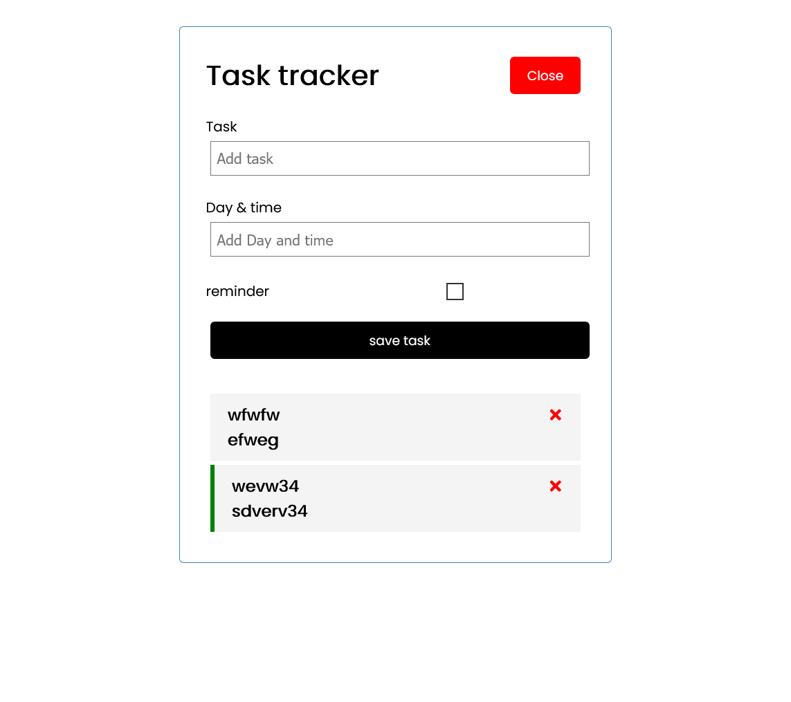

# A SIMPLE TODO LIST MADE WITH REACT

This is a Simple TODO app [MADE WITH REACT.JS](https://reactjs.org/).

## Table of contents

- [The challenge](#the-challenge)
- [Screenshot](#screenshot)
- [Links](#links)
- [Built with](#built-with)
- [What I learned](#what-i-learned)
- [Continued development](#continued-development)

### The challenge

Users should be able to:

- ADD TASK TO THE APP
- BE ABLE TO DELETE TASK FROM THE APP

### Screenshot

### Links

- Solution URL: [solution URL](https://github.com/Iammayank18/ToDo)
- Live Site URL: [live site URL](https://todo-five-xi.vercel.app)

### Built with

- REACT
- JSX(HTML)
- CSS custom properties
- CSS Grid

### What I learned

I learned , how a REACT COMPONET WORKS.

### Continued development

now i will continue working on REACT, and try
